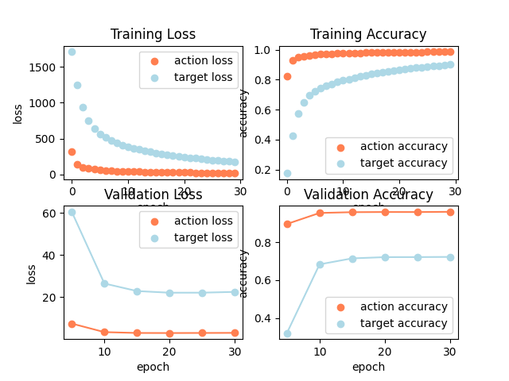

## Run the program
```python train.py \
    --in_data_fn=lang_to_sem_data.json \
    --model_output_dir=experiments/lstm \
    --batch_size=1000 \
    --num_epochs=30 \
    --val_every=5 \
    --emb_dim=128 \
    --hidden_size=128 \
    --force_cpu 
```

## Architecture Design
The design I settled on for my model was first sending my input of size `(B x len_cutoff)` to the embedding layer, sending the embeddings to an lstm, then passing the hidden state from the lstm to two different fully connected layers action_fc and target_fc, which have outputs of size `(B x num actions)` and `(B x num targets)` respectively.

I prioritized speed in my model architecture to allow me to train quickly and see the effects of my changes. Therefore, I tried to reduce the number of learnable paramters as much as possible. My attempts to increase the complexity of the model resulted in worse performing models. I tried adding an extra fc layer and a ReLU after the LSTM layer, to look at the effects of non-linearity, but the model performed worse with this architecture than my current one using the same hyperparamters. 

## Hyperparameters
The hyperparameters I chose after a short period of training were: 
- num_epochs = 30
- emb_dim = 128
- hidden_size = 128

The speed of completion for each epoch was directly related to the embedding dimension and hidden size, which affect the number of parameters that are trained in all four layers. Using a smaller hidden size or embedding dim caused the initial steps of the model to be less accurate.

I additionally found that using the Adam optimizer caused my code to run much faster than when using the SGD optimizer. 

## Model Accuracy / Loss


I was able to achieve a val action accuracy of 0.96 and a loss of 3.0.
For val target accuracy I achieved 0.72 and for loss I got 22.1.

## Extensions
If given more time, I would perform a more careful search over the hyperparameter space to find better values. Additionally, as was mentioned in the slack by Mohammed Alsayed, there are duplicates in the training set that may be contributing to overfitting that I could try to remove to improve the predictions. 

## Bonus
