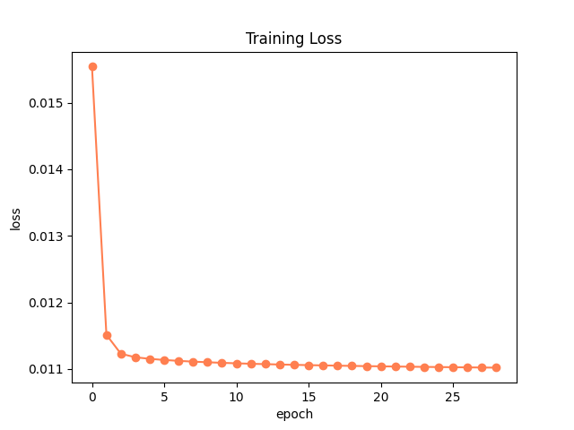
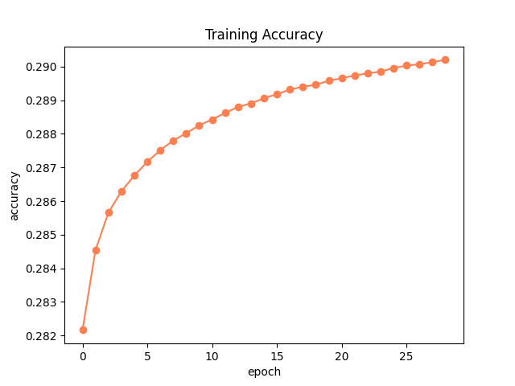
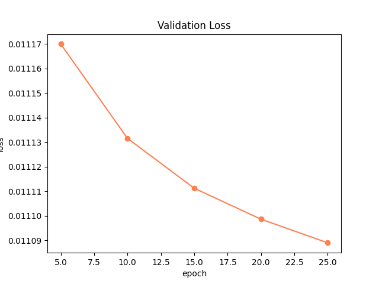
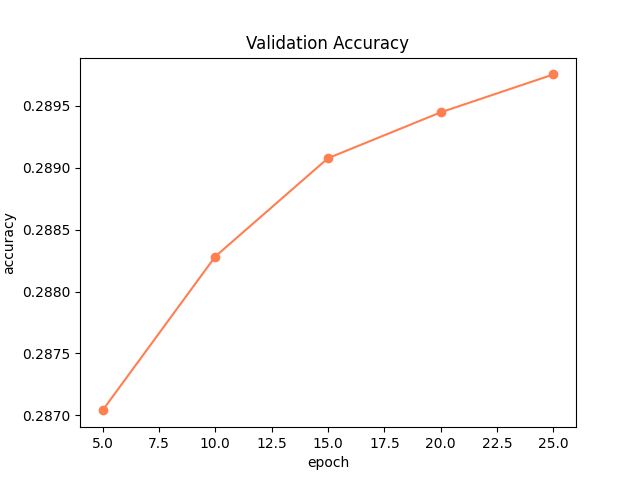

# PA2 Report
Implementation choices and document the performance of your model (both training and validation performance, both in vitro and in vivo) under the conditions you settled on (e.g., what hyperparameters you chose) and discuss why these are a good set. 

The model architecture I chose to implement was Skip-gram, so the inputs are the center words and the outputs are the context words. One implementation quirk I used was storing the outputs as a list of the encoded context words. As discussed in class, this avoided storing size |V| multihot vectors for each word in our corpus and allowed us to store the outputs in memory. I also did not ignore words that didn't have enough non-padding contex to fill the window size. This means that the embeddings that we leard for words that tend to appear at the beginning or end of sentences predict the padding token appearing in the context. 

The hyperparameters I chose for the model included a size 128 embedding dimension and a context window size of 2 and 4. Both these runs were performed with 30 epochs. I wanted an embedding size smaller than the vocab size, but large enough to be able to learn meaningful features to distinguish the 3000 possible words. 

## Metric Explanation
### In Vitro
The in vitro evaluation was performed by computing the accuracy of the model's predictions for the context words for a given center word at each epoch. The model's performance was determined using the validation set. The total number of accurate predictions were divided by the total number of predictions.

For 30 epochs, 128 emedding dim, context window size 4, the model was able to achieve a training loss of 0.011020092907269295, a training accuracy of 0.2902014854311407, a validation loss of 0.011089021908796506 and a validation accuracy of 0.2897550997921627.

### In Vivo
The downstream evaluation task was an analogy task. We effectively perform the operation `A - B = C - D => D = C + B - A` using the word embeddings learned by our model, looking to see if the vector for the word `D` is actually close to the vector made by `C + B - A`. The Exact metric is computed by seeing if the closest word is D. Mean Reciprocal Rank (MRR) is computed by seeing what position `D` appears in the topn words. MR is the inverse of MRR. I believe this corresponds to the Harmonic Mean. According to this [link](https://deepai.org/machine-learning-glossary-and-terms/harmonic-mean) this metric is useful for evaluating the performance of algorithms in information retrieval. The higher the Exact match and the MMR are, the better the performance. 

In the downstream evaluation tasks, the total performance was 0.0015 (Exact); 0.0051 (MRR); 197 (MR). For the semantic relationships, the scores were 0.0010 (Exact); 0.0039 (MRR); 256 (MR). For the syntactic relationships, the scores were 0.0029 (Exact); 0.0084 (MRR); 119 (MR).

## Bonus

### Context Window Size (5pts): 
As seen in the text output below, when the same experiment was performed with a context window size of 2 instead of 4, the performance for the analogy task were 0.0010 (Exact); 0.0047 (MRR); 214 (MR) for semantic relationships and 0.0000 (Exact); 0.0084 (MRR); 119 (MR) for syntactic relationships. Comparing this to the context window of size 4, we see the exact performance for semantic relationships is similar, but the syntactic performance is much lower with a window size of 2. This might be because 2x2 words is not enough for the model to learn about syntax. 

### Larger Scale Pretrained Word Embeddings (5pts): 
TBD

## Text Output
Result for 30 epochs, 128 emedding dim, context window size 2
```
...Total performance across all 1309 analogies: 0.0008 (Exact); 0.0056 (MRR); 177 (MR)
...Analogy performance across 969 "sem" relation types: 0.0010 (Exact); 0.0047 (MRR); 214 (MR)
        relation        N       exact   MRR     MR
        capitals        1       0.0000  0.0011  914
        binary_gender   12      0.0000  0.0206  49
        antonym 54      0.0000  0.0029  350
        member  4       0.0000  0.0017  582
        hypernomy       542     0.0018  0.0054  185
        similar 117     0.0000  0.0035  289
        partof  29      0.0000  0.0033  303
        instanceof      9       0.0000  0.0017  591
        derivedfrom     133     0.0000  0.0042  239
        hascontext      32      0.0000  0.0021  480
        relatedto       10      0.0000  0.0015  669
        attributeof     11      0.0000  0.0020  511
        causes  6       0.0000  0.0028  352
        entails 9       0.0000  0.0014  693
...Analogy performance across 340 "syn" relation types: 0.0000 (Exact); 0.0084 (MRR); 119 (MR)
        relation        N       exact   MRR     MR
        adj_adv 22      0.0000  0.0005  2104
        comparative     7       0.0000  0.0025  408
        superlative     3       0.0000  0.0011  938
        present_participle      62      0.0000  0.0141  71
        denonym 2       0.0000  0.0010  954
        past_tense      64      0.0000  0.0135  74
        plural_nouns    107     0.0000  0.0060  166
        plural_verbs    73      0.0000  0.0059  169
```

Result for 30 epochs, 128 emedding dim, context window size 4
```
...Total performance across all 1309 analogies: 0.0015 (Exact); 0.0051 (MRR); 197 (MR)
...Analogy performance across 969 "sem" relation types: 0.0010 (Exact); 0.0039 (MRR); 256 (MR)
        relation        N       exact   MRR     MR
        capitals        1       0.0000  0.0011  874
        binary_gender   12      0.0833  0.0884  11
        antonym 54      0.0000  0.0067  150
        member  4       0.0000  0.0012  843
        hypernomy       542     0.0000  0.0032  316
        similar 117     0.0000  0.0018  567
        partof  29      0.0000  0.0017  595
        instanceof      9       0.0000  0.0008  1292
        derivedfrom     133     0.0000  0.0017  589
        hascontext      32      0.0000  0.0018  564
        relatedto       10      0.0000  0.0045  221
        attributeof     11      0.0000  0.0038  264
        causes  6       0.0000  0.0005  1828
        entails 9       0.0000  0.0012  863
...Analogy performance across 340 "syn" relation types: 0.0029 (Exact); 0.0084 (MRR); 119 (MR)
        relation        N       exact   MRR     MR
        adj_adv 22      0.0000  0.0038  266
        comparative     7       0.0000  0.0028  359
        superlative     3       0.0000  0.0013  791
        present_participle      62      0.0000  0.0076  132
        denonym 2       0.0000  0.0017  595
        past_tense      64      0.0000  0.0087  115
        plural_nouns    107     0.0093  0.0118  85
        plural_verbs    73      0.0000  0.0065  154
```
## Figures
Figures based on result for 30 epochs, 128 emedding dim, context window size 4




