# PA3 Report
I mainly implemented the standard Encoder Decoder model as well as the Attention based model. I have functioning model using the pytorch transformer, but I have  doubts as to whether it is functioning properly. 

## Implementation Choices

My hyperparameter choices are listed below. They are mostly the same as previous experiments for other HWs. I tried increasing the learning rate by an order of magnitude from and saw some slight improvements. 

- encoder embedding_dim = 128
- action_emb_dim = 6
- target_emb_dim = 18
- hidden_size = 128
- num_epochs = 5
- val_every = 2
- batch_size = 1000

- test data size = 400
- val data size = 100

I chose to create action and target embeddings as discussed in class. I used slightly higher values for the embedding dimension than suggested because I included the `<pad>`, `<BOS>`, `<EOS>` tokens in both the action and target vocabularies. 

My code ran particularly slowly, so for my experiments, I ran my tests with a smaller subset of the test/validation data. I am not sure why this slow down is occuring. It could be because of the property of LSTMs training in sequence, or because the validation metric calculations take a long time. I was unable to confirm the reason.  

Another choice I made was *not* concatenating all the instructions for a specific sequence, instead storing them separately in the tensor passed to the encoder, and then flattening them in the forward pass before passing them through the lstm/transformer. I initially wanted to implement the hierachical encoding for the bonus, but ran out of time. This meant between instructions in an episode, there could be some amount of padding. This added padding could have contributed to my model predicting the pad token very often. 

I used an LSTM for the recurrent cell. A GRU may have been simpler, since it only has the one hidden state and allows me to not worry about the cell state. As of now, I do not perform updates on the cell state while using attention like I do with the hidden state. 

The Attention mechanism I added took the output of the encoder, which stores the hidden state of the lstm at every timestep, and concatenated each hidden state with the hidden state of the decoder from the previous timestep. Then we compute the alphas by passing this through a Fully Connected layer, and then compute the new decoder hidden state by performing a batchwise matrix multiplication over the alphas and the encoder hidden states. 

## Metrics
The two metrics I computed for the predictions were Exact Match using `accuracy_score` and Longest Common Subsequence using the implementation found at this [link](https://www.geeksforgeeks.org/printing-longest-common-subsequence/). I did not use prefix match, since I was getting low scores that I felt didn't give me much information on the model performance. I will say, that I don' think the model is performing well at all, so this metric may be more valid than I gave it credit for. 

## Observations
One thing I noticed when viewing the metrics was that they were artificially being inflated due to the model predicting the `<pad>` token. Often what occurred was the model predicting one set of relatively common action, target pairs, which allowed it to get a decent accuracy. `GotoLocation` was a common action predicted. The loss was still high in my tests, and the CrossEntropy likely should have ignored padding.

The Transformer implementation I made predicted the pad token particularly often in observations I made of the model predictions. 

I also wanted to see if the transformer was able to perform the task in parallel, and perform it faster than the LSTM based seq2seq model implementations. I tried running the LSTM and the Transformer implementations with a train/val size of 800/200. The LSTM implementation would result in my computer terminating the process, whereas the Transformer implementation actually completed, and ran the epochs faster. 

Seeing how the accuracy remained similar over the runs for the Transformer, I am pretty confident it isn't learning well, or is just predicting the padding token. 

## Figures
Figures based on result for hyperparameters stated above

Standard: 
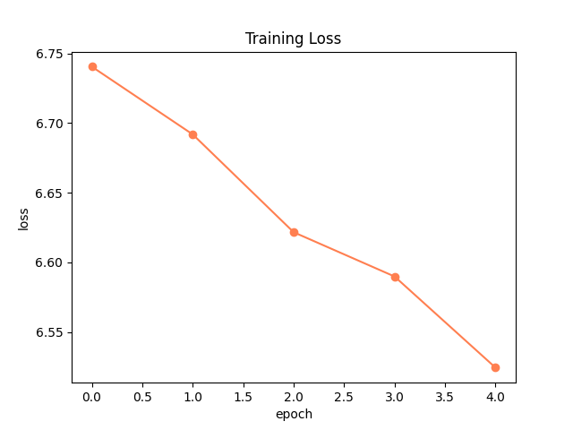
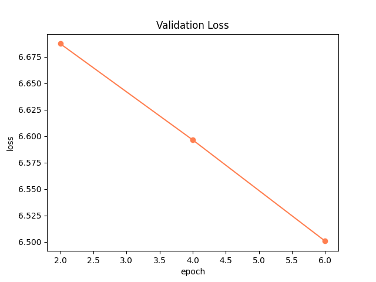
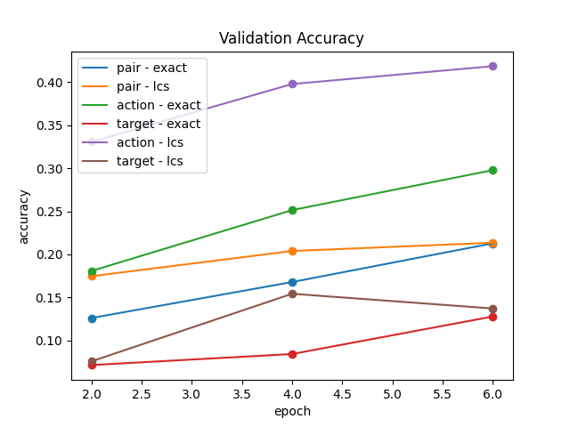
Attention: 
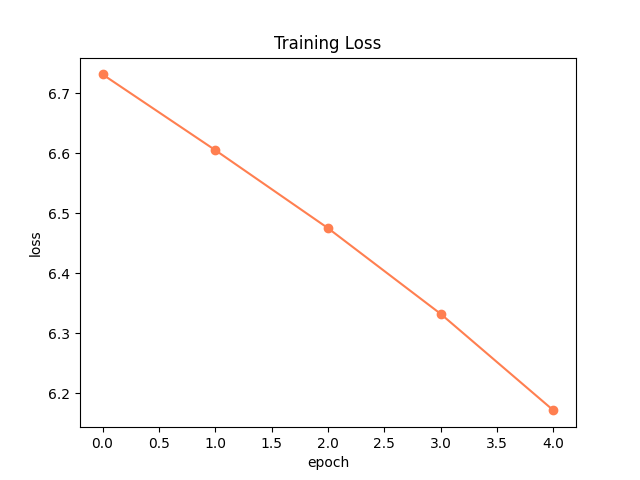
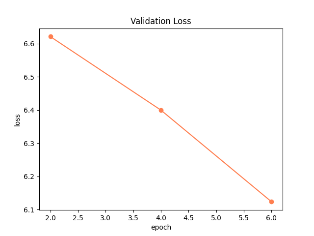
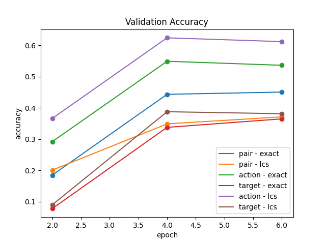
Transformer:
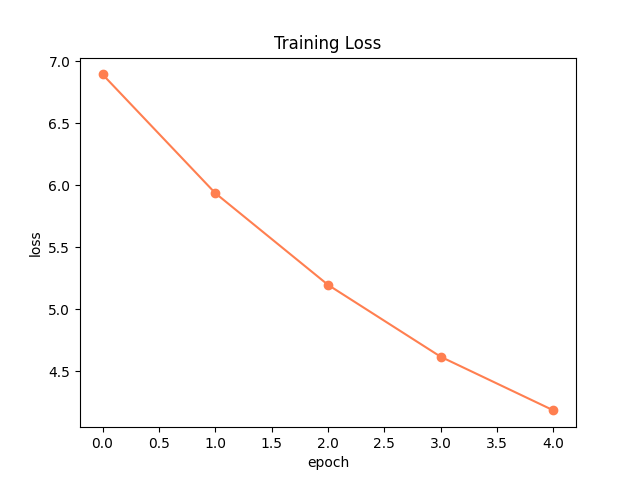
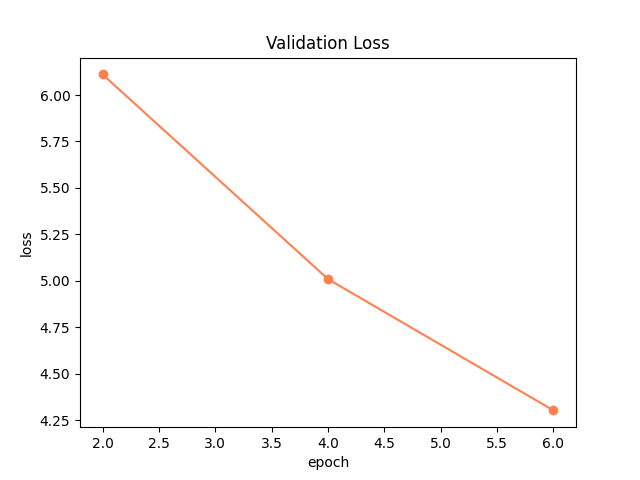
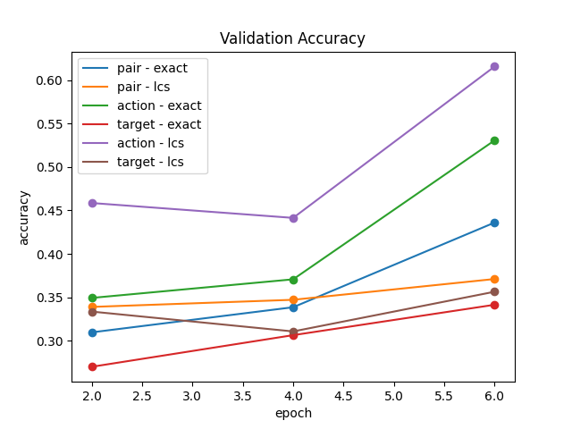

Transformer with 800/200 test/val data
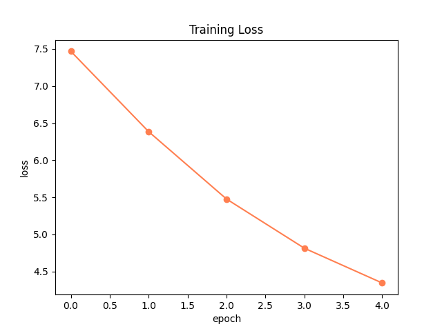
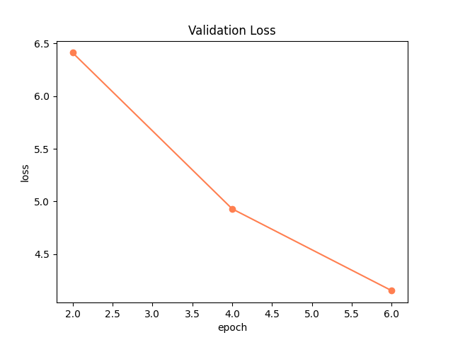
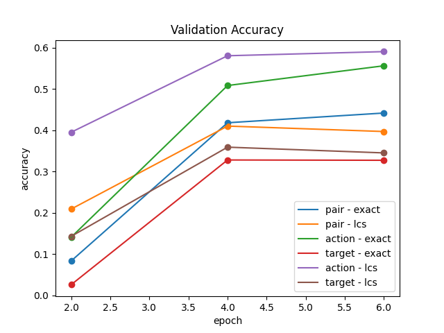

## Example Predictions
Standard:
```
(<BOS> <BOS>)                  -> (<BOS> <BOS>)
(GotoLocation armchair)        -> (GotoLocation countertop)
(GotoLocation remotecontrol)   -> (PickupObject butterknife)
(GotoLocation pot)             -> (GotoLocation sinkbasin)
(GotoLocation pot)             -> (CleanObject butterknife)
(GotoLocation pot)             -> (GotoLocation drawer)
(GotoLocation pot)             -> (PutObject drawer)
(GotoLocation pot)             -> (<EOS> <EOS>)
(PickupObject pot)             -> (<pad> <pad>)
(PickupObject pot)             -> (<pad> <pad>)
(PickupObject pot)             -> (<pad> <pad>)
(PickupObject tomato)          -> (<pad> <pad>)
(SliceObject cart)             -> (<pad> <pad>)
(PutObject <pad>)              -> (<pad> <pad>)
```

Attention: 
```
(<BOS> <BOS>)                  -> (<BOS> <BOS>)
(GotoLocation countertop)      -> (GotoLocation countertop)
(GotoLocation <pad>)           -> (PickupObject butterknife)
(GotoLocation <pad>)           -> (GotoLocation potato)
(GotoLocation <pad>)           -> (SliceObject potato)
(GotoLocation <pad>)           -> (GotoLocation microwave)
(<pad> <pad>)                  -> (PutObject microwave)
(<pad> <pad>)                  -> (GotoLocation fridge)
(<pad> <pad>)                  -> (PickupObject potato)
(GotoLocation <pad>)           -> (GotoLocation microwave)
(<pad> <pad>)                  -> (HeatObject potato)
(<pad> <pad>)                  -> (GotoLocation sinkbasin)
(<pad> <pad>)                  -> (PutObject sinkbasin)
(<pad> <pad>)                  -> (<EOS> <EOS>)
```

Transformer: 
```
(PickupObject <pad>)           -> (<BOS> <BOS>)
(GotoLocation <pad>)           -> (GotoLocation diningtable)
(<pad> <pad>)                  -> (PickupObject ladle)
(GotoLocation <pad>)           -> (GotoLocation pan)
(GotoLocation <pad>)           -> (PutObject pan)
(GotoLocation <BOS>)           -> (PickupObject pan)
(<pad> <pad>)                  -> (GotoLocation sinkbasin)
(<pad> <pad>)                  -> (PutObject sinkbasin)
(<EOS> <pad>)                  -> (<EOS> <EOS>)
(<pad> <pad>)                  -> (<pad> <pad>)
(<pad> <pad>)                  -> (<pad> <pad>)
(<pad> <pad>)                  -> (<pad> <pad>)
(<pad> <pad>)                  -> (<pad> <pad>)
(<pad> <pad>)                  -> (<pad> <pad>)
```

# Bonus

## Hierarchical Encoding (TBD)